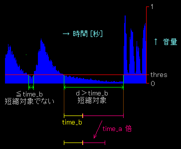

# WAVファイルを短くする

このPerlモジュールはWAVファイルを短くするものです。  
全体を早口にするのではなく、
無音部分を切り詰める事によってコンパクトにします。

## 使用可能な入力ファイル

 - Windows Wave Format (.WAV) で、且つ非圧縮形式である事
 - モノラル/ステレオに対応
 - 8bit/16bit サンプリングに対応

## プラットホーム

Windows、Linux の何れでも動作します。

## 使用方法

Perlプログラム内から次のように呼び出します。

> use mutecut;  
> %**data**= &mutecut(\\%**data**);

引数
 - $**data**{'infile'} = 入力WAVファイル名
 - $**data**{'outfile'} = 出力WAVファイル名
 - $**data**{'**thres**'} = 無音判定しきい値
 - $**data**{'**time_b**'} = 変更対象となる最小無音時間 [秒]
 - $**data**{'**time_a**'} = 無音短縮率
 - $**data**{'tmp'} = テンポラリディレクトリ(省略時は自動決定)

返り値
 - $**data**{'error'} = エラーメッセージ。エラーが無い場合は空

無音の判定は、音量が指定値(**thres**)以下か否かで判定しています。
最大音量(データ上のピークではなくフォーマット上可能な最大音量)を1とした時、
**thres**以下の音量が **time_b**[秒] 
より長く続いた部分が短縮対象となります。(図参照)

短縮対象部分の長さをdとすると、短縮後の長さは
> **time_b** + (d - **time_b**) ⋅ **time_a**



となります。よって **time_a**=0 だと常に**time_b**に短縮され、
**time_a**=1 だと全く短縮されません。

例
```perl
use mutecut;
my (%data);
$data{'infile'} = '/home/myname/indata.wav';
$data{'thres'} = 0.05;
$data{'time_b'} = 0.2;
$data{'time_a'} = 0.4;
$data{'outfile'} = '/home/myname/outdata.wav';
$data{'tmp'} = '.';
%data = &mutecut(\%data);
if ($data{'error'}) {
  print $data{'error'} . "\n";
}
```

